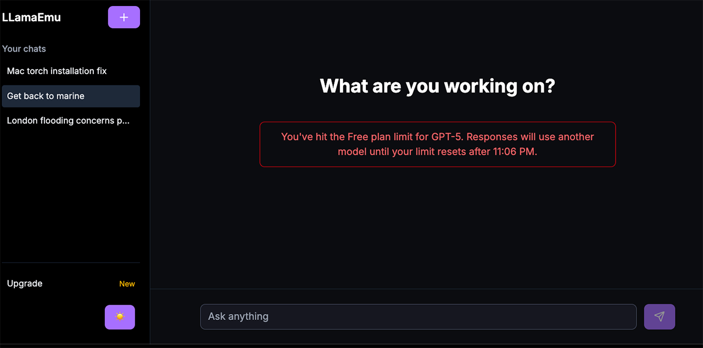

# LLamaEmu

A responsive, production-ready chat interface that seamlessly integrates with any Large Language Model. LLamaEmu is just a plug-and-play UI frontend template. Whether you've trained a model on cooking, customer support, trained your own personal fitness AI bot, or anything else, just connect it and go !



## Overview

LLamaEmu is a universal frontend template designed to work with virtually any LLM—whether self-hosted (fine-tuned Llama models, local deployments) or commercial services (OpenAI, Gemini, Mistral, Groq). The application delivers a modern, polished user experience with real-time streaming, responsive design, and secure API proxying.

**Key Highlights:**
- **Model-agnostic architecture** — switch LLMs without touching the UI
- **Real-time streaming** — powered by Vercel AI SDK for instant responses
- **Fully responsive** — optimized for desktop, tablet, and mobile
- **Secure API proxying** — keep your API keys server-side only
- **Dark/light theme toggle** — with localStorage persistence
- **Clean, modern design** — dark mode–first, dual-column layout

## Interface

The interface features a clean, dark-mode–first dual-column layout optimized for readability and focus across all screen sizes. The responsive design adapts gracefully from mobile to desktop.

## Architecture

### Model-Agnostic API Proxy
Uses Next.js Route Handlers (`/api/chat`) to securely proxy requests to any LLM backend. Your API keys never reach the client—they remain safely on the server. Switch between different providers (UCL Llama, OpenAI, Groq, Mistral) by simply changing a single environment variable.

### Real-Time Streaming
Built on the Vercel AI SDK (`@ai-sdk/react`), responses are streamed in real-time chunks using the `useChat` hook. This creates an immediate, interactive experience similar to ChatGPT.

### Mobile-First Responsive Design
Crafted with Tailwind CSS and CSS variables, LLamaEmu adapts seamlessly across all devices without compromising functionality or aesthetics.

### Client-Side Theming
Theme preference is persisted to localStorage and powered by Tailwind's `darkMode: 'class'` strategy, enabling instant theme switching.

## Tech Stack

| Category | Technology |
|----------|------------|
| **Framework** | Next.js 14+ (App Router, React Server Components) |
| **Streaming & State** | Vercel AI SDK (`@ai-sdk/react`, `ai`) |
| **Styling** | Tailwind CSS (mobile-first, utility-first) |
| **Icons** | Lucide React |
| **Language** | TypeScript |

## Quick Start

### 1. Clone and Install

```bash
git clone https://github.com/YourUsername/llamaemu-frontend.git
cd llamaemu-frontend

npm install
npm install lucide-react  # Icon library
```

### 2. Configure Environment

Create a `.env.local` file in the project root:

```env
# .env.local
# Your LLM API key (server-side only, never exposed to client)
LLAMA_API_KEY="your-secret-api-key-here"

# Optional: API endpoint URL (defaults to OpenAI-compatible endpoint)
LLAMA_API_URL="http://your-custom-api-ip:8000/v1"
```

### 3. Set Your LLM Provider

Edit `src/app/api/chat/route.ts` to configure your desired LLM:

```typescript
// src/app/api/chat/route.ts
import { createOpenAI } from "@ai-sdk/openai";

const model = createOpenAI({
  apiKey: process.env.LLAMA_API_KEY,
  baseURL: process.env.LLAMA_API_URL || "http://localhost:8000/v1",
});

export async function POST(req: Request) {
  const { messages } = await req.json();
  
  const result = await generateText({
    model,
    messages,
    stream: true,
  });

  // ... streaming response
}
```

**Common Provider Examples:**

- **Custom/Self-Hosted**: Set `baseURL` to your local API endpoint
- **OpenAI**: Use `createOpenAI` with `baseURL: "https://api.openai.com/v1"`
- **Groq**: Use `@ai-sdk/groq` provider
- **Mistral**: Use `@ai-sdk/mistral` provider

### 4. Run Locally

```bash
npm run dev
```

Visit `http://localhost:3000` in your browser. The app will hot-reload on changes.

## Plug-and-Play Model Switching

One of LLamaEmu's core strengths is effortless model switching. To change your LLM provider:

1. Update the API key in `.env.local` (if needed)
2. Modify the model configuration in `src/app/api/chat/route.ts`
3. The frontend UI remains **completely unchanged**

**Example: Switching from Custom Llama to OpenAI**

```typescript
// Before: Custom Llama
const model = createOpenAI({
  apiKey: process.env.LLAMA_API_KEY,
  baseURL: "http://localhost:8000/v1",
});

// After: OpenAI
import { openai } from "@ai-sdk/openai";
const model = openai("gpt-4-turbo");
```

## Project Structure

```
llamaemu-frontend/
├── src/
│   ├── app/
│   │   ├── api/
│   │   │   └── chat/
│   │   │       └── route.ts          # LLM API proxy
│   │   ├── layout.tsx                # Root layout & theme provider
│   │   ├── page.tsx                  # Chat interface
│   │   └── globals.css               # Global styles & CSS variables
│   ├── components/
│   │   ├── ChatWindow.tsx            # Main chat container
│   │   ├── MessageList.tsx           # Message rendering
│   │   ├── InputBox.tsx              # User input form
│   │   └── ThemeToggle.tsx           # Dark/light mode switch
│   └── lib/
│       └── utils.ts                  # Utility functions
├── public/
│   └── readme_images/
├── .env.local                        # Environment variables (git-ignored)
├── next.config.js
├── tailwind.config.ts
└── package.json
```

## Configuration Options

### Environment Variables

| Variable | Description | Required |
|----------|-------------|----------|
| `LLAMA_API_KEY` | Your LLM provider's API key | ✅ Yes |
| `LLAMA_API_URL` | Base URL for your LLM endpoint | ❌ No (defaults to OpenAI-compatible) |
| `NEXT_PUBLIC_CHAT_MODEL` | Model identifier (e.g., `gpt-4-turbo`, `mistral-large`) | ❌ No |

### Tailwind & Theme Customization

Edit `tailwind.config.ts` to adjust colors, spacing, or other design tokens. The app uses CSS variables for dynamic theming:

```css
/* src/app/globals.css */
@layer base {
  :root {
    --background: 0 0% 100%;
    --foreground: 0 0% 3.6%;
    /* ... more variables ... */
  }

  [data-theme="dark"] {
    --background: 0 0% 3.6%;
    --foreground: 0 0% 98%;
    /* ... */
  }
}
```

## Deployment

### Vercel (Recommended)

```bash
npm install -g vercel
vercel
```

Add your environment variables in the Vercel dashboard under Project Settings → Environment Variables.

### Docker

```dockerfile
FROM node:18-alpine
WORKDIR /app
COPY package*.json ./
RUN npm ci --omit=dev
COPY .next ./.next
EXPOSE 3000
CMD ["npm", "run", "start"]
```

### Other Platforms

LLamaEmu works on any platform that supports Node.js 18+:
- Netlify, Railway, Render, Heroku, AWS, Google Cloud, etc.

## Contributing

Contributions are welcome! Please feel free to submit issues and pull requests.

## License

This project is open source and available under the MIT License.

## Troubleshooting

**Issue: API key not being recognized**
- Ensure `.env.local` is in the project root (not in `src/`)
- Restart the dev server after updating environment variables

**Issue: CORS errors when connecting to local LLM**
- Verify your LLM endpoint is running and accessible
- Check that `LLAMA_API_URL` matches your endpoint (e.g., `http://localhost:8000/v1`)
- Ensure the backend supports streaming responses

**Issue: Streaming not working**
- Confirm your LLM provider supports streaming
- Check that `stream: true` is set in your API route handler

## Resources

- [Next.js Documentation](https://nextjs.org/docs)
- [Vercel AI SDK](https://sdk.vercel.ai)
- [Tailwind CSS](https://tailwindcss.com)
- [OpenAI API Reference](https://platform.openai.com/docs)

---

**Built for LLM enthusiasts and developers.**
